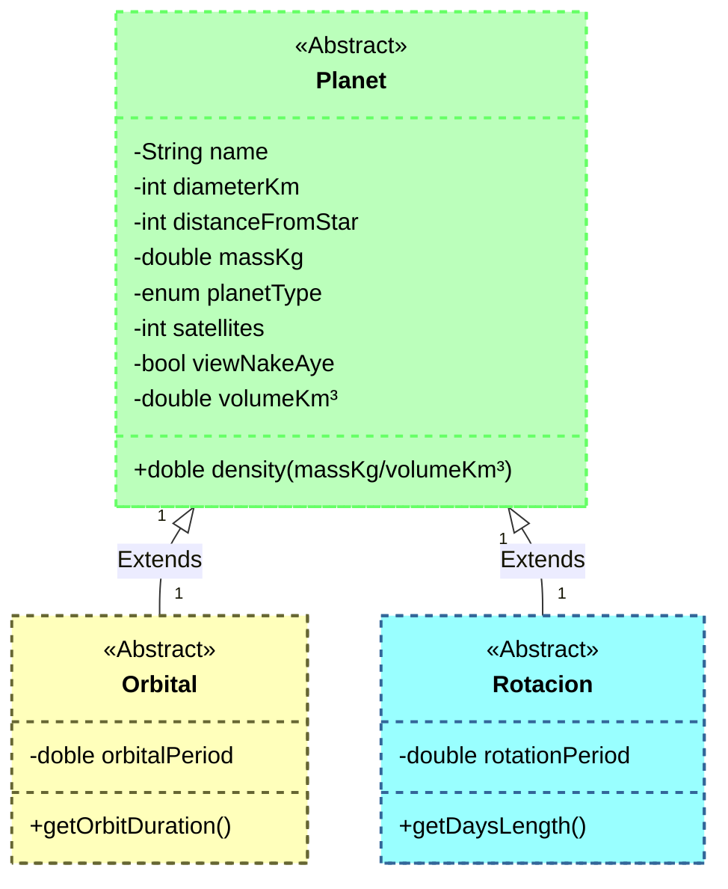

# My_PlanetAbstractClass

# DIAGRAMA DE ABSTRACCION

```mermaid
classDiagram
    class Planet {
        <<Abstract>>
        -String name
        -int diameterKm
        -int distanceFromStar
        -double massKg
        -enum planetType
        -int satellites
        -bool viewNakeAye
        -double volumeKm³
        +doble density(massKg/volumeKm³)
    }

    class Orbital {
        <<Abstract>>
      -doble orbitalPeriod
      +getOrbitDuration()
    }

    class Rotacion {
        <<Abstract>>
      -double rotationPeriod
      +getDaysLength()    
    }


    Planet"1" <|-- "1" Orbital : Extends
    Planet"1" <|-- "1" Rotacion : Extends
    
    style Planet fill:#bfb,stroke:#6f6,stroke-width:2px,color:#000,stroke-dasharray: 5 5
    style Rotacion fill:#9ff,stroke:#369,stroke-width:2px,color:#000,stroke-dasharray: 5 5
    style Orbital fill:#ffb,stroke:#663,stroke-width:2px,color:#000,stroke-dasharray: 5 5


```
