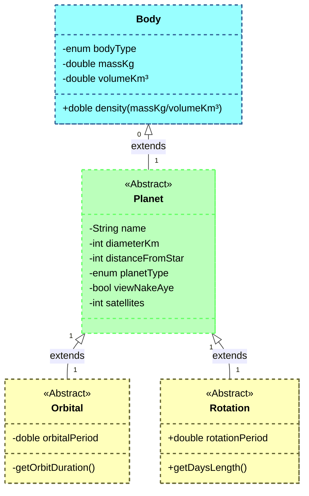
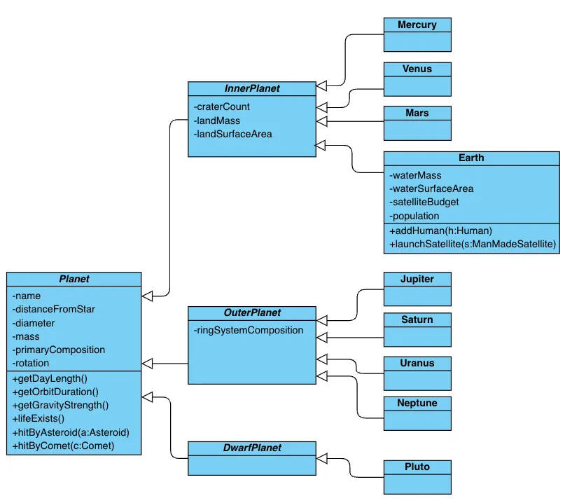

# My_PlanetAbstractClass

# DIAGRAMA DE ABSTRACCION

```mermaid
classDiagram
    class Body {
        -enum bodyType
        -double massKg
        -double volumeKm³
        +doble density(massKg/volumeKm³)

    }
    class Planet {
        <<Abstract>>
        -String name
        -int diameterKm
        -int distanceFromStar
        -enum planetType
        -bool viewNakeAye
        -int satellites
    }

    class Orbital {
        <<Abstract>>
      -doble orbitalPeriod
      -getOrbitDuration()
    }

    class Rotation {
        <<Abstract>>
      +double rotationPeriod
      +getDaysLength()    
    }

    Body   "0"<|-- "1" Planet : extends
    Planet"1" <|-- "1" Orbital : extends
    Planet"1" <|-- "1" Rotation : extends
    
    style Body fill:#9ff,stroke:#369,stroke-width:2px,color:#000,stroke-dasharray: 5 5
    style Planet fill:#bfb,stroke:#6f6,stroke-width:2px,color:#000,stroke-dasharray: 5 5
    style Orbital fill:#ffb,stroke:#663,stroke-width:2px,color:#000,stroke-dasharray: 5 5
    style Rotation fill:#ffb,stroke:#663,stroke-width:2px,color:#000,stroke-dasharray: 5 5


```

#OTRO PUNTO DE VISTA

